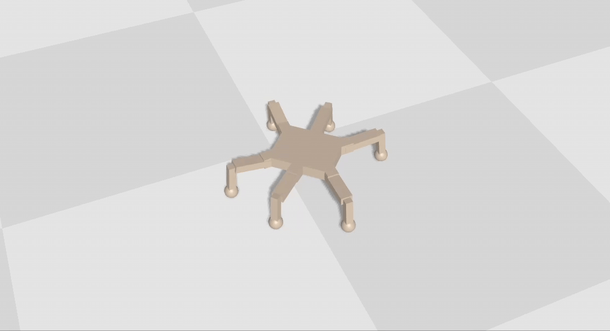

# FLAIR

This is the official repository for the FLAIR algorithm and the paper "Getting Robots Back On Track: Reconstituting Control in Unexpected Situations with Online Learning".

This repository contains the code to both run the real-robot pipeline with the GVR-Bot and the simulated pipeline with the Hexapod. Both pipeline use the same core code of FLAIR but on different environments. 
While we provide instructions for both pipelines, please note that the GVR-Bot pipeline requires the specific sensors used on the original robot. 

## Simulated Hexapod Pipeline

This is the way to go if you want to see an example of FLAIR working quickly!



This pipeline uses [Jax](https://docs.jax.dev/en/latest/index.html), [QDax](https://github.com/adaptive-intelligent-robotics/QDax) and the [Brax simulator](https://github.com/google/brax). 

**Note.** While these libraries are usually used on a GPU, we developed the following example to be run on CPU to avoid specific hardware requirements. 
However, as a consequence, do not expect significative speed-up from running on GPU. 

### Requirements and Singularity container

We provide the detailed requirements in [singularity/requirements.txt](./singularity/requirements.txt).

Alternatively, we also provide the def file of a [Singularity / Apptainer](https://apptainer.org/docs/user/latest/) container that install all the required libraries. This def file can be found in [singularity/singularity.def](./singularity/singularity.def). To build a container from this def file, enter the [singularity/](./singularity/) folder and run the `build_final_image` script. 

### Running a FLAIR example

For simplicity, we provide a default low-level controller for the Hexapod as part of this repository. 
Alternatively, the next section of this README provides steps to re-generate this low-level controller. 
This section covers the steps to see FLAIR in action in the Hexapod environment using this default low-level controller.

First, enter the example repository: [fast\_adaptation/example/](./fast_adaptation/example/).
Second, you would need to execute the file `flair_example.py`, as follows:

```
python3 flair_example.py --save-html
```

We recommend using the `--save-html` flag to see videos of the robot moving. 

This example implements a waypoint-tracking automatic driver, similar to the one used on the real-robot experiments, that guides the Hexapod robot along a Chicane track similar to the one used for the real GVR-Bot robot. 
By default, this example applies a perturbation that reduces the strength of all the motors of one of the legs of the robot (the middle right leg). By default, it also uses our FLAIR hierarchical controller that compensates for the perturbation. 

If you wish to remove the default perturbation, you can de-activate it with the flag `--perturbation-off`. Similarly, if you wish to do a run without our FLAIR method, you can use the FLAIR `--adaptation-off`. You can also combine these flags to see the automatic driver leading the robot around the track in nominal conditions. 

After running this command, the results will appear in the `flair_example` folder. There you can find a plot of the path of the robot along the chicane track, as well as an HTML file that lets you visualise the robot and freely move the camera or change the simulation speed to study your robot. 


### Low-level controller training

If you are interested in re-training the low-level controller of this pipeline, you can execute the `train_map_elites.py` script as follows:

```
python3 train_map_elites.py
```

Note that this script uses the QDax library implementation of the MAP-Elites algorithm to generate a collection of controllers for the Hexapod that are then used to drive using differential drive commands. 

If you wish to visualise the MAP-Elites map and learning curves you can run the following (this would work for the default low-level controller as well):

```
python3 plot_map_elites.py
```


## GVR-Bot Pipeline

This is the way to go if you have the required hardware to reproduce the real-world experimental results of FLAIR. 


This pipeline also uses [Jax](https://docs.jax.dev/en/latest/index.html) for fast and efficient FLAIR made to run directly on GPU. However, it also uses ROS2 and docker-compose to implement the different modules and their communication. 
Unlike the simulated pipeline, the data collection, model training and model inference parts need to be run in parallel and the different components of the system require ROS to communicate. 


### Building Docker Images

Run the following commands to build the `docker` container:

```
docker build -t airl:flair -f airl/Dockerfile .
docker build -t airl:ros2_light -f airl/Dockerfile.ros2_light .
docker build -t airl:zeds -f airl/Dockerfile.stereolabs .
```

### Starting Script

Before running any part of the scripts, it is necessary to compile the ROS scripts via the [build_messages.sh](fast_adaptation/bin/build_messages.sh) script.
```
cd fast_adaptation && ./build_messages.sh
```

Once this step is done, it is possible to start the full pipeline.
The script to start our docker pipeline can be run via the [start_flair.sh](fast_adaptation/bin/start_flair.sh) script.
```
./start_flair.sh
```

We run the docker-compose pipeline on our NVIDIA Jetson Orin 32Gb that is directly connected to a VectorNav V100 IMU and a Zed2 Camera in addition to the GVRBot. The docker-compose file that is executed can be found [here](fast_adaptation/docker_compose_flair.yaml).


**Note.** Our setup requires the user to first start the ROS server on the GVRBot before running our pipeline (we note that the GVRBot runs ROS whereas our codebase is written in ROS2, but we provide a rosbridge as part of our pipeline that handles all the communication).


#### Automatic Driver

Finally, to launch the automatic driver, it is necessary to restart the container called `vicon` which will then listen to the VICON system sending out messages to the rostopic named after the tracked object. In our case this is the `"/vicon/GVRBot_IC/GVRBot_IC"` topic. (See [File](fast_adaptation/src/flair/flair/vicon.py)). In case you are running your the code on your own system, you need to adjust the topic names.
Run the command:

```
./restart_container.sh vicon
```

#### Structure

The main script implementing FLAIR is called [adaptation.py](fast_adaptation/src/flair/flair/adaptation.py). This script starts the multiple processes taking care of the data collection, processing and training. The code for each of these functionalities can be found in the [functionality_controller](fast_adaptation/src/flair/functionality_controller) folder which is imported into the `adaptation.py` script. The controller for the code can be found in the [functionality_controller.py](fast_adaptation/src/flair/functionality_controller/functionality_controller.py) file, which is the code directly producing the commands.

### Configurations

All the parameters that can be tweaked can be found in a configuration file called [adaptation_config.py](fast_adaptation/src/flair/flair/adaptation_config.py). All the parameters listed here have been used for the experimental runs reported in our paper.

The script [vicon.py](fast_adaptation/src/flair/flair/vicon.py) contains the exact waypoints used for our experiments (which correspond to our lab settings), but they can easily be replaced by your path. At the beginning of the file, you can chose the perturbation you would like to apply to the robot. This file can be replaced by a manual controller for example if required.

### Baselines

In addition to the code for FLAIR, we publish our baselines under the files [adaptation_rl.py](fast_adaptation/src/flair/flair/adaptation_rl.py) and [adaptation_lqr.py](fast_adaptation/src/flair/flair/adaptation_lqr.py). Similarly, the files producing the commands at each step are called [functionality_controller_rl.py](fast_adaptation/src/flair/functionality_controller/functionality_controller_rl.py) and [functionality_controller_lqr.py](fast_adaptation/src/flair/functionality_controller/functionality_controller_lqr.py).

The script to start our docker pipeline for the baselines can be run via the [rl_start.sh](fast_adaptation/bin/rl_start.sh) script.
```
./rl_start.sh
```

or 
```
./lqr_start.sh
```
All the parameters that can be tweaked can be found in a configuration file called [adaptation_config_rl.py](fast_adaptation/src/flair/flair/adaptation_config_rl.py) or [adaptation_config_lqr.py](fast_adaptation/src/flair/flair/adaptation_config_lqr.py). All the parameters listed here have been used for the experimental runs reported in our paper.

